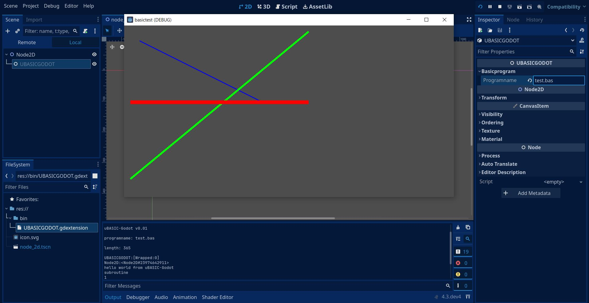

# gdextension-uBASIC-Godot
gdextension uBASIC-Godot

a first picture:    

yet another example for gdextension. imho i think theres still not enough documentation for gdextension.    
im interested in interpreters and i found uBASIC (you can find on github, too).   
a cool oldschool basicinterpreter. for example variables have only one letter lowercase a-z, means only 26 variables.    
i inject uBASIC with gdextension to godot as a node. i pimped some things for godot like change from printf to godots print.    
now it will be possible to pimp the basic with some godot-specific-commands - im still thinking ...    
programmed in c++ for windows with godot 4.2.1 godot-cpp.    
the basic-program test.bas produces the output you see in the pic:    

5 print "hello world from uBasic-Godot"    
10 gosub 100    
20 for i = 1 to 3    
30 print i;    
40 next i    
45 print "3\*2+4="    
46 print 3\*2+4    
50 print "end"    
60 end    
100 print "subroutine"    
110 return;    

# usage:   
with the dll in bin, godot should know the new node, you can find if you search for UBASICGODOT.    
Godot generates also a helppage.    
in inspector select the UBASICGODOT-node and type in the name of the basic-program.   
in this test it is test.bas   
you can write own programs with texteditor of your choice.    

# build:   
for build, you have to insert godot-cpp, follow the gdextension-example in godot-docs    
if you build it for example for linux you have to expand some files like UBASICGODOT.gdextension...    

# contact:    
sys_temerror@web.de    
before pullrequest/merging please contact me and talk with me...    
